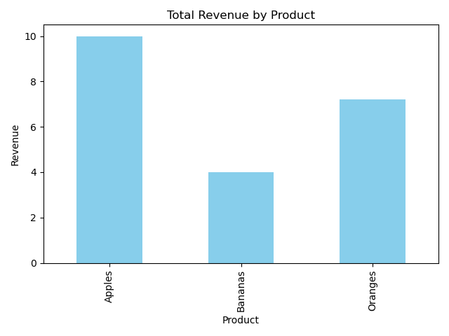

# 📊 Sales Summary using SQLite and Python

This project extracts and visualizes basic sales data from a tiny SQLite database using Python, SQL, pandas, and matplotlib. It was completed as part of **Task 7** in a data analysis learning module.

---

## 📌 Objective

To connect a SQLite database to Python, run SQL queries to get basic sales information (total quantity and revenue per product), and display the results using a bar chart.

---

## 🧰 Tools & Technologies

- Python 🐍
- SQLite (built-in)
- pandas
- matplotlib
- Jupyter Notebook / Python Script

---

## 🗃️ Dataset

- The SQLite database (`sales_data.db`) contains a single table: `sales`
- Sample fields:
  - `id` (auto-incremented primary key)
  - `product` (text)
  - `quantity` (integer)
  - `price` (real)

---

## 🧠 Key Tasks

- Created SQLite database and inserted sample data
- Ran SQL queries inside Python to summarize:
  - Total quantity sold per product
  - Total revenue generated per product
- Visualized the revenue using a bar chart with `matplotlib`

---

## 📈 Sample Output

- Printed table with total quantity and revenue
- Bar chart showing revenue per product

---
